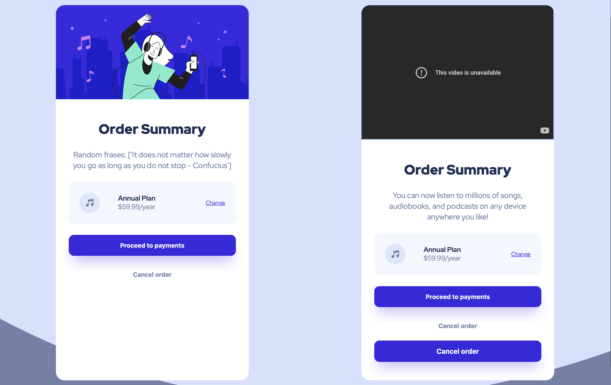

# flask-random-frases in the AWS

* Create virtualenv:  `virtualenv ~/.venv && source ~/.venv/bin/activate`
* Install:  `make all`
* Run:  `python app.py`

[You can view it heve](https://flask-random-motivation.vercel.app/)

